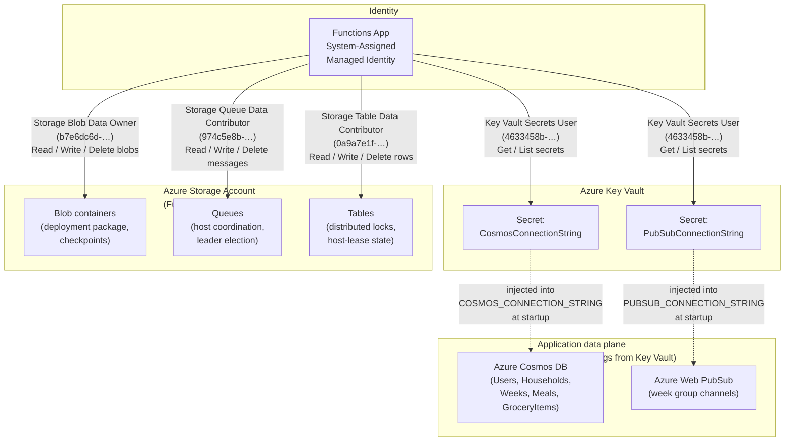

# IAM Roles — Infrastructure Reference

This document describes every Azure RBAC role assigned by the Phase 1 Bicep
infrastructure (`infra/modules/`), why each role is needed, which principal
holds it, and which resource it is scoped to.

---

## Role assignments

| Role name | Role ID (GUID) | Assigned to | Scoped to | Purpose |
|---|---|---|---|---|
| **Storage Blob Data Owner** | `b7e6dc6d-f1e8-4753-8033-0f276bb0955b` | Functions App — system-assigned managed identity | Storage Account | Grants full read/write/delete control over Blob containers. The Azure Functions runtime stores the deployment package (via `WEBSITE_RUN_FROM_PACKAGE`) and internal checkpoint data in Blob storage. Owner-level access (rather than Contributor) is required because the runtime also manages container-level ACLs. |
| **Storage Queue Data Contributor** | `974c5e8b-45b9-4653-ba55-5f855dd0fb88` | Functions App — system-assigned managed identity | Storage Account | Grants read/write/delete access to Queue storage. The Functions host uses queues for internal coordination between function instances (e.g. timer-trigger leader election, poison-message queues). |
| **Storage Table Data Contributor** | `0a9a7e1f-b9d0-4cc4-a60d-0319b160aaa3` | Functions App — system-assigned managed identity | Storage Account | Grants read/write/delete access to Table storage. The Functions runtime uses tables to persist distributed locks, host-lease state, and durable-task history. |
| **Key Vault Secrets User** | `4633458b-17de-408a-b874-0445c86b69e6` | Functions App — system-assigned managed identity | Key Vault | Grants `Get` and `List` access to Key Vault secrets. The Functions runtime resolves `@Microsoft.KeyVault(…)` app-setting references at startup to inject `CosmosConnectionString` and `PubSubConnectionString` into the process environment without ever storing those values in app settings directly. |

> **No stored credentials.** All four assignments target the Functions App's
> **system-assigned managed identity**. Azure issues short-lived tokens
> automatically — no passwords, connection strings, or SAS tokens appear in
> environment variables or source control.

---

## Data-flow diagram

The diagram below traces every data access path from the perspective of the
identities and roles involved.  Application-level flows (Cosmos DB reads/writes
and Web PubSub publishes) are shown separately because they use connection
strings retrieved from Key Vault rather than direct RBAC.

### Reading the diagram

| Line style | Meaning |
|---|---|
| Solid arrow | RBAC role assignment — the managed identity presents an Azure-issued token |
| Dashed arrow | Runtime injection — the connection string retrieved from Key Vault is used by the application code to open a direct data-plane connection |

### Why these roles are sufficient

* The Functions App never needs `Owner` or `Contributor` at the **subscription**
  or **resource group** level.  Each role is scoped to the narrowest possible
  resource (the storage account or the key vault).
* Cosmos DB and Web PubSub are accessed via **connection strings** (stored in
  Key Vault), not RBAC, because the Cosmos SDK and Web PubSub SDK used by the
  application code authenticate with a connection string rather than a managed
  identity token.  A future improvement would be to migrate both to
  role-based access (`Cosmos DB Built-in Data Contributor` and
  `Web PubSub Service Owner`) and remove the connection strings from Key Vault
  entirely.
